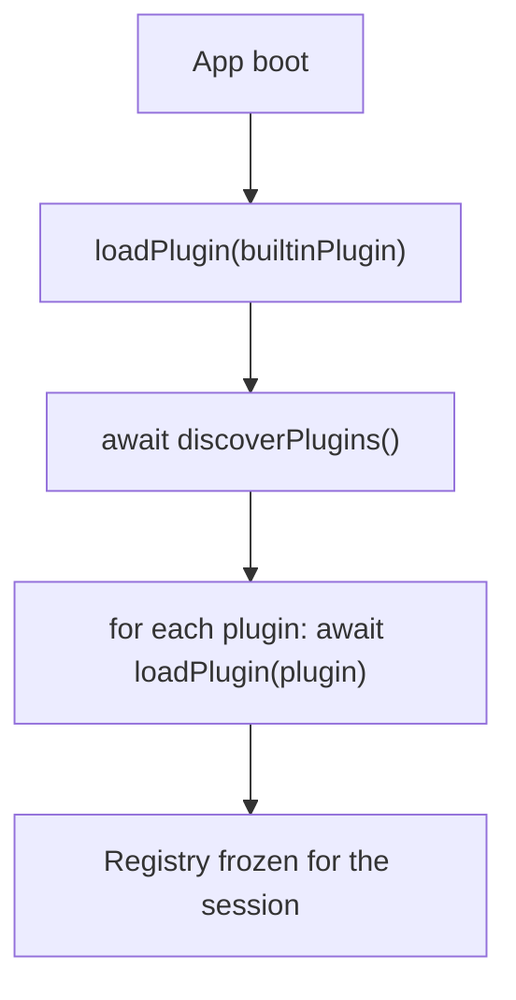

# Autoría de complementos (plugins)

*Contrato público para paquetes de nodos externos que extienden el editor de Pascal.*

Aplica a: cualquier cosa que proporcione un `Plugin` para que el editor lo cargue.

Esta página documenta el **contrato**, no una implementación de cargador. El sitio de llamada del host
(`discoverPlugins()`) ya está en su lugar; convertirlo en un cargador de red real es un plan
separado.

## Forma de un plugin

Un plugin es un objeto JS que exporta un símbolo — el manifiesto:

```ts
import type { Plugin } from '@pascal-app/core'

export const myPlugin: Plugin = {
  id: 'acme:furniture-pack',
  apiVersion: 1,
  nodes: [
    couchDefinition,
    armchairDefinition,
    // ...
  ],
}
```

| Campo | Requerido | Notas |
|---|---|---|
| `id` | sí | Único globalmente. Usa `vendor:pack-name` para evitar colisiones. El host lo trata como opaco. |
| `apiVersion` | sí | Actualmente `1`. El host lanza un error ante una discrepancia — aumentarlo rompe los plugins, intencionalmente. |
| `nodes` | opcional | Arreglo de `AnyNodeDefinition`. |

El repositorio independiente [`pascalorg/plugin-trees`](https://github.com/pascalorg/plugin-trees) es
el ejemplo trabajado. Clónalo como punto de partida.

La misma forma alimenta al plugin integrado `pascal:core` en `@pascal-app/nodes` — no existe un formato
"interno" de plugin. Lo que funciona para los integrados funciona para terceros.

## Qué puede aportar un `NodeDefinition`

El manifiesto `Plugin` central posee las definiciones semánticas de nodos (y las extensiones de
inspector respaldadas por el registro); la UI del host y la presentación general del visor siguen
siendo exportaciones separadas. Cada entrada de `nodes` es un `NodeDefinition<S extends ZodObject>` que
el registro sella con `kind`, `schemaVersion`, `schema` y cualquier combinación de:

- `defaults` — valores iniciales de campo para instancias nuevas.
- `capabilities` — indicadores `selectable` / `duplicable` / `deletable` / `surfaces` / `relations`
  consumidos por el framework.
- `parametrics` — forma de UI de inspector derivada automáticamente (`fields` + vía de escape opcional
  `customPanel`).
- `renderer` — componente React 3D personalizado (GLB, drei, TSL — opta fuera de `def.geometry`).
- `system` — trabajo por fotograma (animación, propagación de suciedad (dirty-cascade), estado en
  tiempo de ejecución).
- `geometry` — `(node, ctx) => Object3D` puro para el `<GeometrySystem>` genérico.
- `floorplan` — `(node, ctx) => FloorplanGeometry` puro para la capa 2D.
- `floorplanAffordances` / `floorplanMoveTarget` — manejadores de arrastre 2D.
- `tool` / `affordanceTools` — herramientas 3D de colocación y movimiento (componentes diferidos/lazy).
- `affordanceHints` — pistas HUD para un rediseño (reshape) propiedad del tipo, con la misma clave que
  `affordanceTools`; la extensión `reshapeLayers` de floorplan (su contraparte 2D) y
  `actionMenu.actions` (botones del menú de acciones) completan el conjunto.
- `presentation` — metadatos de paleta / barra lateral (`label`, `icon`, `paletteSection`, etc.).
- `mcp` — descripciones de herramientas MCP para consumidores de IA.
- `relations` / `computeLevelData` — búsquedas entre hermanos + precomputación por lotes de nivel.

Consulta [`node-definitions.md`](node-definitions.md) para el modelo de composición de tres casillas que
integra todo esto.

## Alojamiento de hijos (hosting)

Se asume que un renderizador paramétrico personalizado monta hijos arbitrarios a menos que su definición
declare `rendersChildren: false`. Declara false para proxies de selección, renderizadores colectivos y
renderizadores que solo muestran un tipo de hijo restringido. Una definición solo-geometría hereda el
montaje de hijos del framework. El esquema `children` del host debe conservar el id real del hijo,
incluidos los prefijos de id específicos del plugin. `capabilities.surfaces.hosting: false` opta fuera
como host; `capabilities.surfacePlacement: 'floor-only'` opta fuera como hijo alojado.

## Mantenerse sobre el suelo (terreno)

El sitio lleva un campo de alturas esculpido (heightfield), por lo que "el piso" no es el plano `y = 0`.
Un tipo de plugin que fija `0` como su base se ve correcto en un lote plano y se entierra en la ladera
en uno esculpido. No hay capacidad que declarar ni nada que registrar — elige la opción que coincida con
cómo tu tipo obtiene su Y, y el terreno lo sigue:

- **Tu nodo se apoya sobre una superficie** → declara `capabilities.floorPlaced` con una `footprint`
  (o `footprints` para una compuesta). Entonces `FloorElevationSystem` eleva la malla registrada cada
  fotograma, eligiendo entre losas (slabs) superpuestas y el terreno según cada footprint. Ese es todo
  el contrato: un árbol, una banca, una jardinera no necesitan nada más.
- **Tu constructor `def.geometry` hornea su propio origen vertical** → lee `ctx.levelBaseAt(x, z)` en
  lugar de escribir `0`. Devuelve el terreno en ese punto local al nivel (`0` cuando no hay terreno bajo
  el piso). Llamarlo también inscribe a tu tipo en la invalidación de terreno, de modo que el constructor
  se vuelve a ejecutar cuando el suelo se mueve; no conectas una regla de suciedad. Está **ausente para
  `def.floorplan`** — la vista en planta no tiene elevación —, así que un constructor compartido entre 2D
  y 3D debe usar `ctx.levelBaseAt?.(x, z) ?? 0`.
- **Envías un `renderer` colectivo** (un componente que dibuja muchos nodos — mallas instanciadas, un
  buffer combinado) → eres dueño de la Y de cada instancia. `FloorElevationSystem` escribe en el objeto
  *registrado* del nodo, que para un tipo colectivo es el proxy de selección invisible, no la instancia,
  por lo que un `node.position[1]` crudo por instancia ignora tanto las losas como el terreno. Resuelve a
  través de `getFloorStackedPosition({ node, nodes, position })` al escribir la matriz de cada instancia,
  y confirma la posición **base** (`[x, 0, z]`) desde tu herramienta de colocación — la elevación es
  presentación, nunca se almacena.

Muestrea el terreno en el mismo XZ donde está anclada tu geometría. Un manejador, una guía de ajuste
(snap) y la malla que muestrean puntos distintos en una pendiente divergirán visiblemente. Antecedentes:
[`vertical-model.md`](vertical-model.md#inheriting-terrain-the-generic-seam).

## Importación de paquetes del host

Un plugin importa de los paquetes publicados `@pascal-app/*` — la misma superficie que usan los
integrados, a la manera de dependencias pares (peer dependencies):

```ts
// Schemas, types, registry types
import {
  type AnyNode,
  type NodeDefinition,
  type Plugin,
  z, // re-exported from zod for schema authoring
} from '@pascal-app/core'

// Viewer-side primitives (lazy: only inside renderers / systems)
import { useNodeEvents, NodeRenderer } from '@pascal-app/viewer'

// Editor-side primitives (lazy: only inside `tool` / `affordanceTools`)
import { useDragAction, EDITOR_LAYER } from '@pascal-app/editor'
```

Los paquetes son **dependencias pares (peer dependencies)**, no dependencias normales — la app del host
es la dueña de la versión. Un plugin que fija su propia copia de `@pascal-app/core` crearía dos registros
y fallaría silenciosamente. (La resolución de peer-dependencies de npm lo detecta al instalar.)

## Siguiendo las preferencias de apariencia y rendimiento del visor

Un `renderer` personalizado es dueño de sus materiales, por lo que debe seguir los mismos ejes de
apariencia del host que los nodos integrados. Suscríbete solo de lectura a `useViewer` para `shading`,
`textures`, `colorPreset` y `sceneTheme`; no agregues interruptores de calidad específicos del plugin ni
copies esos valores en los datos de escena.

- **Colored + Rendered** conserva los materiales creados de un modelo importado.
- **Colored + Solid** usa `createDefaultMaterial(..., 'solid')` u otra variante de
  `MeshLambertNodeMaterial` en caché. Preserva el mapa de albedo creado, el color, la transparencia y las
  ranuras de material, pero omite los mapas solo-PBR que anulan la ruta más económica de Solid.
- **Monochrome** usa `createSurfaceRoleMaterial(def.surfaceRole, colorPreset, side,
  sceneTheme)`. Las props importadas normalmente declaran `surfaceRole: 'furnishing'`.
- Captura los materiales creados una vez cuando el modelo carga, guarda en caché las variantes por
  material de origen, intercambia solo cuando cambian las preferencias y restaura antes de eliminar
  (dispose). Nunca clonar materiales por fotograma, mutar materiales creados en caché del loader ni
  eliminar un material devuelto por la caché de un host.

`shadows`, `edges` y el costo de postprocesado Solid/Rendered son globales del host. La geometría normal
de un plugin permanece en `SCENE_LAYER`, de modo que el conjunto de luces y el pipeline de
profundidad/normal la incluyen automáticamente. Las vistas previas de colocación propias del editor
pertenecen a `OVERLAY_LAYER` / `EDITOR_LAYER`; esto mantiene los fantasmas fuera de los pases de sombra,
SSGI y bordes de tinta (ink-edge). Un plugin solo necesita gestionar `castShadow` / `receiveShadow` para
mallas transparentes o superpuestas, en lugar de duplicar los ajustes del host.

Consulta [materiales y temas](materials-and-themes.md#external-plugin-renderers) para el patrón de ciclo
de vida de materiales.

## Ciclo de vida



`loadPlugin` es **solo-adición (add-only)** para v1. Quitar en caliente un tipo requeriría desmontar cada
instancia montada en la escena — fuera de alcance. Los plugins se cargan una vez al arrancar.

`registerNode` lanza un error ante un `kind` duplicado, así que dos plugins que envíen
`kind: 'couch'` producen un error al inicio, no una sobrescritura silenciosa.

## Descubrimiento: `setPluginDiscovery`

El host llama a `discoverPlugins()` después de que el plugin integrado carga. La implementación
predeterminada devuelve `[]`. Las apps que envían plugins externos la reemplazan antes de que el módulo
de arranque (bootstrap) se evalúe:

```ts
// In app boot, BEFORE `import './pascal-bootstrap'`
import { setPluginDiscovery } from '@pascal-app/core'
import { myPlugin } from '@acme/furniture-pack'

setPluginDiscovery(async () => {
  // Static import: bundled into the app.
  return [myPlugin]

  // Or fetch a manifest, dynamic-import each entry, etc.
  // const manifest = await fetch('/plugins.json').then(r => r.json())
  // return Promise.all(manifest.map(m => import(m.url).then(mod => mod.default)))
})
```

`setPluginDiscovery` es global. Llamarlo dos veces sobrescribe silenciosamente — el orden con el import
de arranque importa.

## Paneles del host e instalación en el proyecto

El manifiesto `Plugin` central sigue siendo agnóstico al renderizador. Un plugin que también envía UI del
editor exporta un `EditorHostPanel` por separado:

```ts
import type { EditorHostPanel } from '@pascal-app/editor'

export const myHostPanel: EditorHostPanel = {
  id: 'acme:furniture-pack:catalog',
  pluginId: 'acme:furniture-pack',
  label: 'Furniture pack',
  description: 'A curated furniture catalog.',
  creator: {
    name: 'Acme',
    url: 'https://acme.example',
  },
  pluginUrl: 'https://github.com/acme/pascal-furniture-pack',
  icon: { kind: 'iconify', name: 'lucide:armchair' },
  component: () => import('./catalog-panel'),
}
```

El host registra ese panel con `registerEditorHostPanel`. Los plugins registrados aparecen en la barra
lateral de Plugins, mientras que `installedPlugins: string[]` del grafo de escena controla qué paneles de
plugin aparecen en la barra de íconos de ese proyecto. `defaultInstalled: true` incluye a un plugin de
primera parte en los proyectos heredados y los nuevos; Nature lo usa hoy.

La instalación/desinstalación es una operación de visibilidad a nivel de proyecto. El código de los
plugins y las definiciones de nodos permanecen cargados durante la sesión del navegador porque
`loadPlugin` es solo-adición, pero el panel, la UI de colocación, los renderizadores, los sistemas y la
salida de planos de piso de un plugin desinstalado quedan deshabilitados. Los nodos de plugin existentes
permanecen serializados en el grafo de escena y vuelven a ser visibles cuando el plugin se reinstala; la
desinstalación jamás borra datos del proyecto.

`creator` y `pluginUrl` son metadatos opcionales de administración. Seleccionar un plugin en la barra
lateral de Plugins abre su página de detalle, donde el host muestra estos metadatos y el control de
instalación/desinstalación del proyecto.

Los paneles del host se montan de forma diferida (lazy) dentro de un límite de error. Usa las variables
CSS del host, mantén el CSS acotado al plugin y no escribas estilos globales.

## Contribuciones de presentación del visor

Un plugin también puede exportar un subárbol R3F solo de presentación por separado de su manifiesto
central. Úsalo para visuales derivados de toda la escena como atmósfera, clima o entorno que no son nodos
creados:

```tsx
import type { ViewerPresentationContribution } from '@pascal-app/viewer'

export const myPresentation: ViewerPresentationContribution = {
  id: 'acme:landscape:presentation',
  pluginId: 'acme:landscape',
  component: () => import('./presentation'),
}
```

La aplicación lo registra durante el mismo pase de arranque que el plugin y el panel del host:

```ts
import { registerViewerPresentation } from '@pascal-app/viewer'

registerViewerPresentation(myPresentation)
```

`@pascal-app/editor` monta el host público de contribuciones `<ViewerPresentations />` una vez en sus
visores de edición y de vista previa. Un host que compone un `<Viewer>` crudo monta
`<ViewerPresentations />` explícitamente. No pongas también la misma contribución en `viewerSceneSlot`;
eso la monta dos veces.

Cuando `pluginId` está presente, la contribución se monta solo mientras ese id esté en
`installedPlugins` del proyecto. El registro sigue siendo solo-adición por sesión; la desinstalación del
proyecto libera el subárbol montado y la reinstalación crea uno nuevo. Los fallos de carga diferida y de
renderizado se aíslan por contribución. Las contribuciones deben limpiar los recursos de Three.js al
desmontar y mantener toda la propiedad acotada a la escena por cada `Scene` de R3F, de modo que dos
instancias de Viewer no puedan afectarse entre sí.

La presentación está fuera de `scene-renderer` y, por lo tanto, fuera de la exportación del modelo
semántico. No debe crear nodos creados, valores `pascalId`, objetivos de selección/consulta ni entradas
de historial. El registro tampoco ofrece persistencia: la configuración versionada de plugins pertenece a
un archivo lateral (sidecar) del proyecto propiedad del host, y el host debe llamar explícitamente a las
funciones públicas de importar/exportar del plugin.

## Versionado

`apiVersion: 1` cubre la superficie anterior. El host sube la versión mayor cuando elimina o cambia la
forma de un campo existente. Los campos opcionales nuevos no suben la versión. El plan es mantener las
adiciones compatibles hacia atrás el mayor tiempo posible — el bump es la vía de escape, no el
comportamiento predeterminado.

El versionado propio de los datos de un plugin es `schemaVersion` en cada `NodeDefinition`. El host no
migra; el `migrate(node, fromVersion)` (futuro) del plugin gestiona sus propios nodos persistidos
heredados.

## Lo que *no* es (todavía) una contribución de plugin

- **Materiales** — no existe una ranura `plugin.materials`. Usa `createMaterial` de `@pascal-app/viewer`
  dentro de tu `def.renderer` / `def.system`.
- **Primitivas de plano de piso** — la unión `FloorplanGeometry` pertenece al host. Para dibujar algo que
  la unión no puede expresar, usa como alternativa `def.renderer` y renderiza a través de otro montaje 2D
  (o abre un issue).
- **Paneles / UI de barra lateral en el manifiesto central** — específicos del host. Exporta un
  `EditorHostPanel` por separado para hosts que usan `@pascal-app/editor`.
- **Stores** — los plugins crean sus propios stores de Zustand; no extienden `useScene`, `useEditor` ni
  `useViewer`. Un renderizador puede suscribirse solo de lectura al estado de presentación del host
  exportado, como los ejes de apariencia de `useViewer`, pero no debe tratar los stores del host como
  estado propiedad del plugin.
- **Rutas / páginas** — los plugins son código de visualización + interacción, no superficies completas
  de app. Alojar una página de ajustes pertenece a la app.

El límite se mantiene estrecho a propósito para que el contrato sea publicable. Cada elemento "todavía
no" es un plan, no un "nunca".

## Probando tu plugin

`@pascal-app/nodes` es la implementación de referencia integrada, y
[`pascalorg/plugin-trees`](https://github.com/pascalorg/plugin-trees) es el ejemplo independiente. Para
probar localmente:

1. Compila tu plugin como un paquete npm normal con `@pascal-app/*` como peerDependencies.
2. En una app host que consuma tus integrados (`apps/editor` es el objetivo más fácil), conecta
   `setPluginDiscovery` para que devuelva tu plugin.
3. El registro de consola `[pascal:registry]` en modo de desarrollo muestra el id del plugin cargado +
   el recuento de nodos — ese es el ancla de verificación.

La prueba de paridad del propio host (`packages/nodes/src/index.test.ts`) verifica que cada discriminador
de `AnyNode` tenga un tipo registrado. Los tipos aportados por plugins no participan en esa prueba (no
están en `AnyNode`); agrega una prueba equivalente de tu lado si mantienes una unión escrita a mano en
otro lugar.